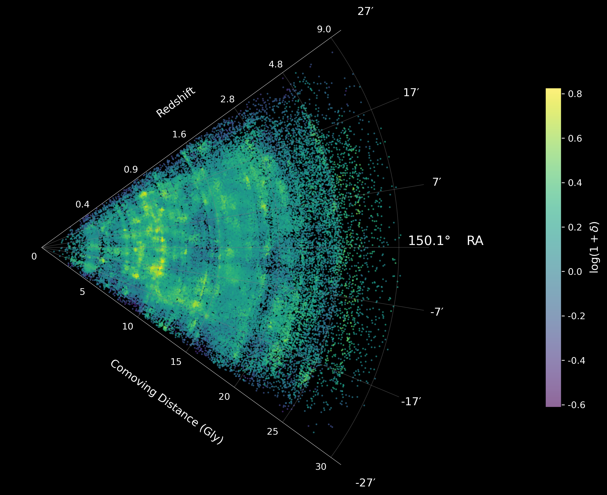

# CosmicWeb

CosmicWeb is a pipeline for reconstructing the COSMOS-Web large-scale structure using weighted kernel density estimation (KDE). The workflow produces per-slice density maps, per-galaxy overdensities, and files that can be used for visualization and analysis. For a full detail of the procedure, you can read Hatamnia et al. 2025.

---

## Data Release

All reconstructed density maps and per-galaxy overdensity catalogs will soon be public.
Links will be added here when available.
---

## Pipeline

### 1. Galaxy Weight Estimation
Photometric-redshifts are used to compute statistical weights for each galaxy.  
**File:** `1-Weight_Estimations.ipynb`

### 2. Bandwidth Estimation
Smoothing bandwidths are derived for each redshift slice.  
**File:** `2-Bandwidth.ipynb`

### 3. Density Map Construction
Weighted KDE density maps are generated for all slices across the COSMOS-Web field.  
**File:** `3-Density_Construction.py`

### 4. Per-Galaxy Density Extraction
Each galaxy’s overdensity is computed.  
**File:** `4-Galaxy_Density.ipynb`

### 5. Using the Generated Products
Instructions and examples showing how to load density maps and visualize them.  
**File:** `5-Plotting_Slices.ipynb`

---

## Citing This Work

If you use any part of this pipeline, please cite:

- Hatamnia et al. 2025  
- Taamoli et al. 2024  
- Chartab et al. 2020  
- Darvish et al. 2015

A BibTeX block will be added once the main paper is released.

---

## AR Demonstration (External Project)

An augmented-reality visualization of COSMOS-Web has been developed in Unity.

https://github.com/user-attachments/assets/f8176ba1-4457-4a67-8840-c80d784037c3

